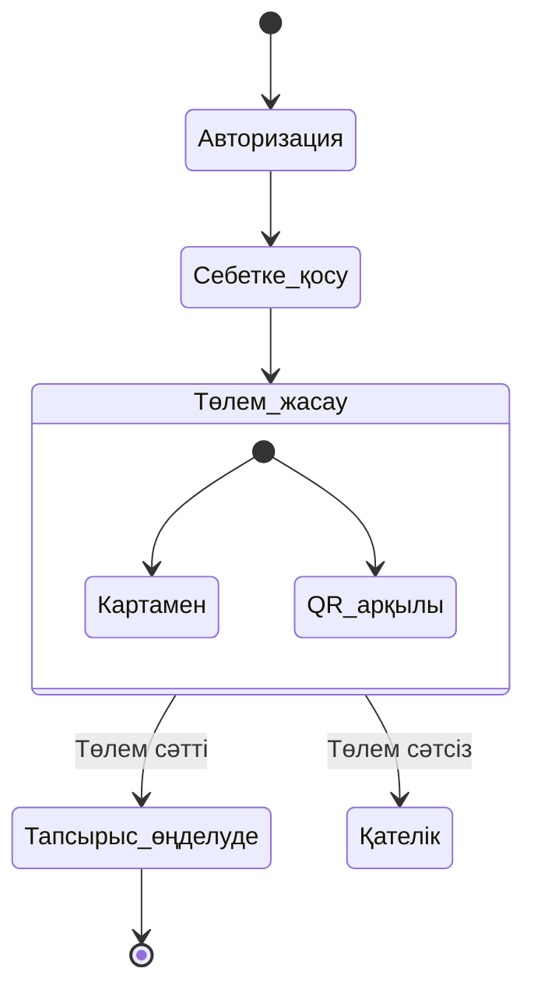

# 35
# Тапсырыс беру және Төлем жасау процесінің Activity Диаграммасы

Бұл жобада пайдаланушының жүйеде авторийзатциядан өту, себетке тауар қосу және төлем жасау процестерінің күйлер диаграммасы (Activity / State Diagram) сипатталған.

## Activity (State) Диаграммасы

---

## Диаграмманы орындау сценарийі

1. **Авторизация:** Пайдаланушы жүйеге кіреді.
2. **Себетке қосу:** Қажетті тауарларды таңдап, себетке қосады.
3. **Төлем жасау:** Төлем түрін таңдайды (Банк картасымен немесе QR-код арқылы).
4. **Нәтиже:**
   * **Төлем сәтті өтсе:** Тапсырыс өңдеуге жіберіліп, процесс аяқталады.
   * **Төлем сәтсіз болса:** Жүйе «Қателік» күйіне өтеді.
